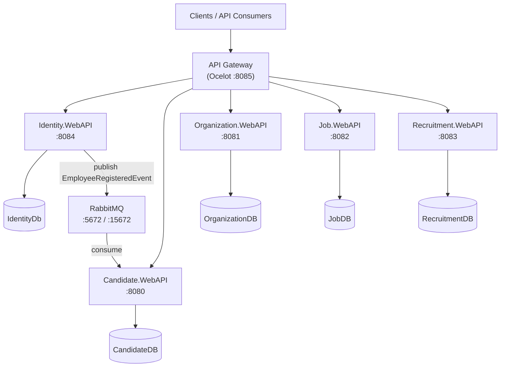
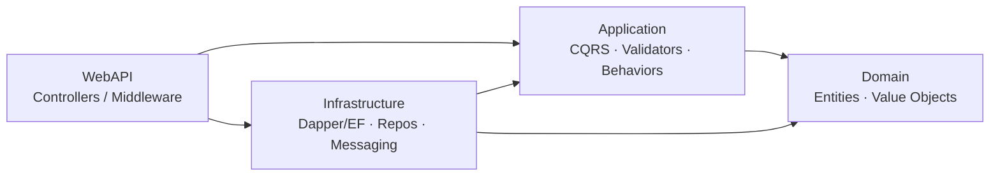
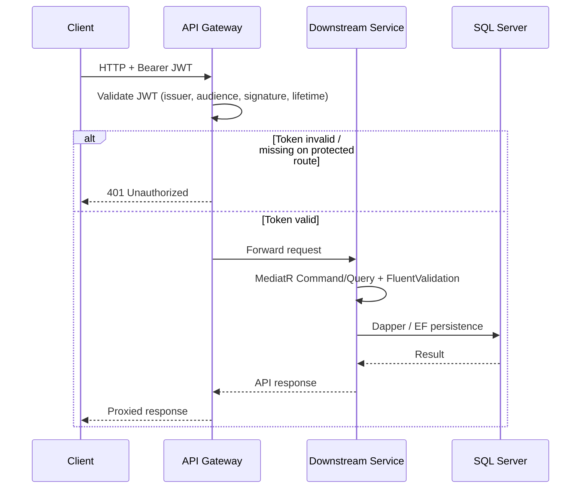
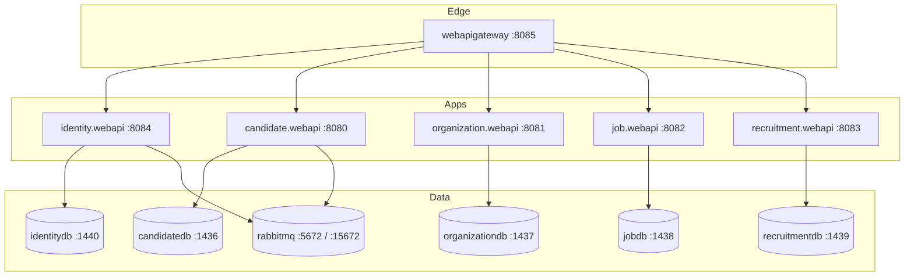
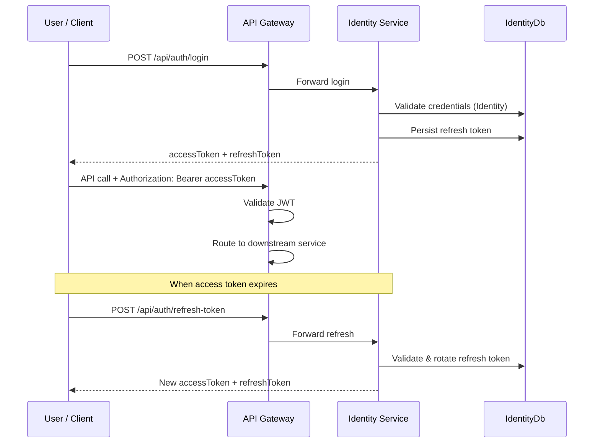
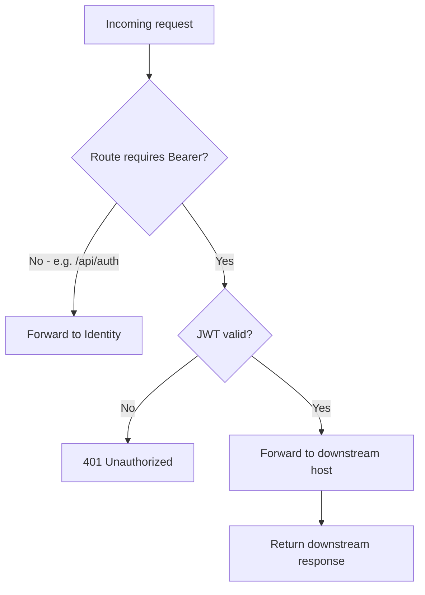
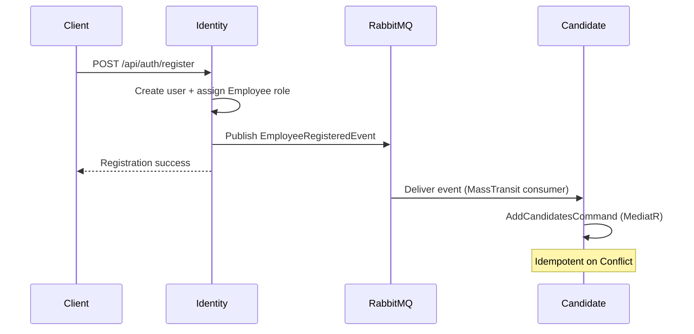
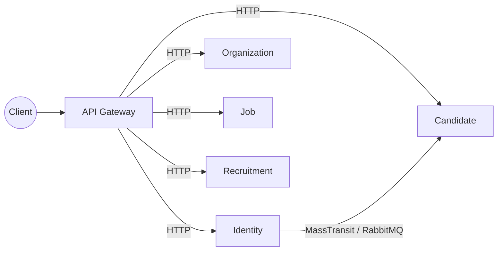
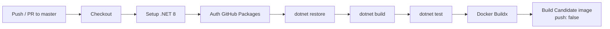

# 🎯 Recruitment Management System

[](https://dotnet.microsoft.com/)
[](https://www.docker.com/)
[](https://www.microsoft.com/sql-server)
[](https://www.rabbitmq.com/)
[](https://ocelot.readthedocs.io/)
[](#)
[](.github/workflows/publish.yml)

A production-oriented **microservice-based Recruitment Management System** built with **.NET 8**.  
It covers the full hiring lifecycle — candidate profiles, organizations, job postings, applications, offers — behind a single **Ocelot API Gateway**, with a dedicated **Identity Service** for authentication and authorization.

> **Audience:** Beginners can follow the setup guides; experienced developers will find architecture, messaging, and security details below.

---

## ✨ Features

| Area | Capabilities |
|------|----------------|
| **Identity & Security** | Register, login, JWT access tokens, refresh-token rotation, revoke, forgot/reset password, role management (`Admin`, `Recruiter`, `Employee`) |
| **Candidate Management** | Profiles, skills, experience, education, certifications, resume uploads |
| **Organization Management** | Organizations and organization members |
| **Job Management** | Job postings, required skills, saved jobs |
| **Recruitment Pipeline** | Applications, application comments, offers |
| **API Gateway** | Central routing, JWT validation, CORS via Ocelot |
| **Event-Driven Sync** | Identity publishes `EmployeeRegisteredEvent`; Candidate service creates a candidate profile |
| **Observability Basics** | Gateway health endpoint, Swagger per service, Docker healthchecks for RabbitMQ & SQL Server |
| **Quality** | Clean Architecture, CQRS (MediatR), Repository pattern, FluentValidation, unit tests (xUnit + Moq) |
| **DevOps** | Docker Compose orchestration, GitHub Actions build/test + Docker image build |

---

## 🏗 Architecture

The system follows **Microservices + Clean Architecture** with a **Database-per-Service** model.

### Architectural pillars

| Concept | How it is applied |
|---------|-------------------|
| **Microservices Architecture** | Independent deployable services: Identity, Candidate, Organization, Job, Recruitment, API Gateway |
| **Database per Service** | Each service owns its SQL Server database (no shared tables across services) |
| **API Gateway (Ocelot)** | Single entry point; routes `/api/*` to downstream services and enforces JWT on protected routes |
| **Identity Service** | ASP.NET Core Identity + EF Core; issues JWTs and manages roles/refresh tokens |
| **JWT Authentication** | Short-lived access tokens (15 minutes by default) validated at the gateway and services |
| **Refresh Tokens** | Stored hashed; rotatable and revocable; default lifetime 7 days |
| **RabbitMQ (Event-driven)** | MassTransit over RabbitMQ for async publish/subscribe (e.g. registration → candidate creation) |
| **Docker** | Compose stack for apps, databases, RabbitMQ, and SQL init jobs |
| **Dapper** | Lightweight data access for domain microservices (stored-proc / SQL script style) |
| **Clean Architecture** | `Domain` → `Application` → `Infrastructure` → `WebAPI` layering per service |
| **CQRS** | Commands and queries separated via MediatR handlers |
| **Repository Pattern** | Persistence abstracted behind repositories / DB executors |
| **Dependency Injection** | Built-in .NET DI + Scrutor for assembly scanning |
| **SOLID Principles** | Small interfaces, single-responsibility handlers, composition over inheritance |

### High-level architecture



### Clean Architecture (per service)



### Request flow (via gateway)



---

## 🧩 Microservices

| Service | Responsibility | Database | Technologies | Communication |
|---------|----------------|----------|--------------|---------------|
| **API Gateway** (`WebAPIGateway`) | Single entry point, JWT auth at edge, CORS, routing | — | ASP.NET Core, Ocelot, JwtBearer | Sync HTTP → all services |
| **Identity** (`Identity.WebAPI`) | Auth, users, roles, refresh tokens, password reset | `IdentityDb` | ASP.NET Identity, EF Core, MediatR, MassTransit | Sync HTTP; **publishes** RabbitMQ events |
| **Candidate** (`Candidate.WebAPI`) | Candidate profiles, skills, education, experience, certifications, resumes | `CandidateDB` | Dapper, MediatR, FluentValidation, MassTransit | Sync HTTP; **consumes** `EmployeeRegisteredEvent` |
| **Organization** (`Organization.WebAPI`) | Organizations & members | `OrganizationDB` | Dapper, MediatR, FluentValidation | Sync HTTP |
| **Job** (`Job.WebAPI`) | Jobs, job skills, saved jobs | `JobDB` | Dapper, MediatR, FluentValidation | Sync HTTP |
| **Recruitment** (`Recruitment.WebAPI`) | Applications, comments, offers | `RecruitmentDB` | Dapper, MediatR, FluentValidation | Sync HTTP |
| **RabbitMQ** | Async messaging broker | — | RabbitMQ 3 Management | AMQP pub/sub via MassTransit |
| **Messaging.Contracts** | Shared integration event contracts | — | .NET class library | Referenced by publishers & consumers |

---

## 🛠 Technology Stack

### Backend

| Technology | Purpose |
|------------|---------|
| .NET 8 / ASP.NET Core | Service runtime & Web APIs |
| MediatR | CQRS command/query pipeline |
| FluentValidation | Request validation |
| Scrutor | DI assembly scanning |
| Swashbuckle | OpenAPI / Swagger UI |
| Ocelot | API Gateway |
| ASP.NET Core Identity | User & role store (Identity service) |
| Entity Framework Core 8 | Identity persistence & migrations |
| Dapper | High-performance SQL access (domain services) |
| Microsoft.Data.SqlClient | SQL Server connectivity |
| MassTransit | Messaging abstraction over RabbitMQ |
| xUnit + Moq | Unit testing |

### Database

| Technology | Purpose |
|------------|---------|
| Microsoft SQL Server 2022 | Database-per-service stores |
| SQL init scripts | Schema bootstrap for Candidate / Organization / Job / Recruitment |
| EF Core Migrations | Schema bootstrap for Identity |

### Infrastructure

| Technology | Purpose |
|------------|---------|
| Docker & Docker Compose | Local/dev orchestration |
| GitHub Actions | CI: restore, build, test, Docker image |
| GitHub Packages (NuGet) | Private package feed (`Common.*` libraries) |

### Messaging

| Technology | Purpose |
|------------|---------|
| RabbitMQ 3 (Management UI) | Message broker |
| MassTransit.RabbitMQ | Publish/subscribe integration |
| `Messaging.Contracts` | Shared event DTOs |

### Containerization

| Artifact | Purpose |
|----------|---------|
| Per-service `Dockerfile` | Build service images |
| `src/docker-compose.yml` | Services, DBs, RabbitMQ, volumes, healthchecks |
| `src/docker-compose.override.yml` | Local port mappings & Development environment |

---

## 📁 Project Structure

```text
Recruitment Management System/
├── .github/
│   └── workflows/
│       └── publish.yml              # CI: build, test, Docker image
├── src/
│   ├── Recruitment-Microservice.sln # Solution entry point
│   ├── docker-compose.yml           # Compose definitions
│   ├── docker-compose.override.yml  # Local ports / env overrides
│   ├── .env.example                 # Environment variable template
│   ├── docker/
│   │   └── db/                      # SQL init shell scripts
│   ├── BuildingBlocks/
│   │   └── Messaging.Contracts/     # Shared integration events
│   ├── Identity/                    # Auth microservice (Clean Architecture)
│   │   ├── Identity.Domain/
│   │   ├── Identity.Application/
│   │   ├── Identity.Infrastructure/
│   │   └── Identity.WebAPI/
│   ├── WebApiGateway/
│   │   └── WebAPIGateway/           # Ocelot gateway + ocelot.json
│   ├── Services/
│   │   ├── Candidate/               # Domain + Application + Infrastructure + WebAPI
│   │   ├── Organization/
│   │   ├── Job/
│   │   └── Recruitment/
│   └── tests/                       # Application & WebAPI unit tests per service
└── README.md
```

### Folder purpose

| Path | Purpose |
|------|---------|
| `src/BuildingBlocks` | Cross-cutting shared contracts (messaging events) |
| `src/Identity` | Authentication & authorization bounded context |
| `src/WebApiGateway` | Edge gateway (routing, JWT, CORS) |
| `src/Services/*` | Business microservices, each with Clean Architecture layers |
| `*/Core/*.Domain` | Entities, value objects, domain rules |
| `*/Core/*.Application` | CQRS features, validators, application abstractions |
| `*/Infrastructure` | Dapper/EF, repositories, JWT, messaging adapters |
| `*/WebAPI` | HTTP controllers, middleware, Swagger, Dockerfiles, SQL scripts |
| `src/docker` | Database initialization scripts for Compose |
| `src/tests` | Automated tests mirroring service boundaries |
| `.github/workflows` | Continuous integration pipelines |

---

## 💻 System Requirements

| Requirement | Version / Notes |
|-------------|-----------------|
| **OS** | Windows 10/11, macOS, or Linux |
| **SDK** | [.NET SDK 8.0.x](https://dotnet.microsoft.com/download/dotnet/8.0) |
| **IDE** (optional) | Visual Studio 2022 / JetBrains Rider / VS Code |
| **Docker** | Docker Desktop **4.x+** with Compose v2 |
| **Docker Compose file format** | `3.4` (as defined in repo) |
| **Database** | SQL Server 2022 (provided via Docker images) |
| **Message broker** | RabbitMQ 3 (provided via Docker) |
| **Git** | Latest recommended |
| **NuGet access** | GitHub Packages credentials for private `Common.*` packages (see CI / local NuGet.config) |

> SQL Server SA passwords must meet Microsoft complexity rules (used in `.env`).

---

## 🚀 Getting Started

### 1. Clone the repository

```bash
git clone https://github.com/rabbi1123/Recruitment-Management-System-Microservice-Architecture.git
cd Recruitment-Management-System-Microservice-Architecture
```

### 2. Configure environment variables

```bash
cd src
cp .env.example .env
```

Edit `src/.env` and set strong passwords (and optional JWT secret). See [Environment Variables](#-environment-variables).

### 3. Restore packages

```bash
cd src
dotnet restore Recruitment-Microservice.sln
```

> If restore fails against GitHub Packages, authenticate NuGet to `https://nuget.pkg.github.com/rabbi1123/index.json` with a PAT that has `read:packages`.

### 4. Configure `appsettings` (optional for local non-Docker runs)

Each service under `*/WebAPI/appsettings.json` and `appsettings.Development.json` contains connection strings, JWT, and RabbitMQ settings. For Docker Compose, most values are overridden by environment variables in `docker-compose.yml`.

### 5. Run infrastructure & services with Docker

From `src/`:

```bash
docker compose --env-file .env up -d --build
```

This starts:

- RabbitMQ + management UI  
- Five SQL Server instances + init jobs  
- Identity, Candidate, Organization, Job, Recruitment APIs  
- API Gateway  

### 6. Database initialization / migrations

| Service | How schema is applied |
|---------|------------------------|
| Candidate / Organization / Job / Recruitment | Compose `*-db-init` containers run SQL scripts from each service’s `DB/` folder |
| Identity | EF Core `MigrateAsync()` runs automatically on Identity.WebAPI startup |

No manual `dotnet ef` step is required for the default Docker flow.

### 7. Start / verify the API Gateway

Gateway default URL (Compose override):

```text
http://localhost:8085
```

Health check:

```bash
curl http://localhost:8085/health
```

Expected:

```json
{ "status": "healthy" }
```

### 8. Explore APIs (Swagger)

| Service | Swagger URL |
|---------|-------------|
| Candidate | http://localhost:8080/swagger |
| Organization | http://localhost:8081/swagger |
| Job | http://localhost:8082/swagger |
| Recruitment | http://localhost:8083/swagger |
| Identity | http://localhost:8084/swagger |
| Gateway | http://localhost:8085 (routes only; use service Swagger or gateway paths) |

### 9. Frontend

This repository currently hosts the **backend microservices and gateway**.  
Point any frontend SPA/mobile client at the **API Gateway** base URL (`http://localhost:8085`) and use the auth endpoints under `/api/auth/*`.

---

## 🐳 Docker Setup

### Architecture (Compose)



### Build and run

```bash
cd src
cp .env.example .env   # if not already done
docker compose --env-file .env up -d --build
```

### Useful commands

```bash
# View running containers
docker compose ps

# Follow logs (example: identity)
docker compose logs -f identity.webapi

# Stop stack
docker compose down

# Stop and remove volumes (⚠️ deletes DB data)
docker compose down -v
```

### Host port map

| Container | Host port | Internal |
|-----------|-----------|----------|
| `candidate.webapi` | 8080 | 8080 |
| `organization.webapi` | 8081 | 8080 |
| `job.webapi` | 8082 | 8080 |
| `recruitment.webapi` | 8083 | 8080 |
| `identity.webapi` | 8084 | 8080 |
| `webapigateway` | 8085 | 8080 |
| `candidatedb` | 1436 | 1433 |
| `organizationdb` | 1437 | 1433 |
| `jobdb` | 1438 | 1433 |
| `recruitmentdb` | 1439 | 1433 |
| `identitydb` | 1440 | 1433 |
| RabbitMQ AMQP | 5672 | 5672 |
| RabbitMQ UI | 15672 | 15672 |

RabbitMQ Management UI: http://localhost:15672 (default `guest` / `guest` unless overridden).

---

## 🔐 Environment Variables

Copy `src/.env.example` → `src/.env`.

| Variable | Description | Example |
|----------|-------------|---------|
| `Candidate_DB_PASSWORD` | SA password for Candidate SQL Server | `YourStrong!Passw0rd` |
| `Organization_DB_PASSWORD` | SA password for Organization SQL Server | `YourStrong!Passw0rd` |
| `Job_DB_PASSWORD` | SA password for Job SQL Server | `YourStrong!Passw0rd` |
| `Recruitment_DB_PASSWORD` | SA password for Recruitment SQL Server | `YourStrong!Passw0rd` |
| `Identity_DB_PASSWORD` | SA password for Identity SQL Server | `YourStrong!Passw0rd` |
| `RABBITMQ_USERNAME` | RabbitMQ user | `guest` |
| `RABBITMQ_PASSWORD` | RabbitMQ password | `guest` |
| `SecretKey` | JWT signing key used by Identity & Gateway in Compose (`JwtSettings__SecretKey`) | `DevOnly-ChangeMe-Min32Chars-IdentityKey!` |
| `DOCKER_REGISTRY` | Optional image registry prefix | _(empty for local)_ |

> **Security tip:** Never commit `.env`. Use secrets managers in production and rotate `SecretKey` / DB passwords regularly. Access tokens are short-lived; treat refresh tokens as credentials.

---

## 🗄 Database

Each microservice owns an isolated database (**Database-per-Service**).

| Service | Database | Host port (Compose) | Ownership / notes |
|---------|----------|---------------------|-------------------|
| Identity | `IdentityDb` | 1440 | ASP.NET Identity tables + `RefreshTokens`; EF migrations |
| Candidate | `CandidateDB` | 1436 | Profiles, skills, education, experience, certifications, resumes; SQL script init |
| Organization | `OrganizationDB` | 1437 | Organizations & members; SQL script init |
| Job | `JobDB` | 1438 | Jobs, job skills, saved jobs; SQL script init |
| Recruitment | `RecruitmentDB` | 1439 | Applications, comments, offers; SQL script init |

Cross-service consistency (e.g. new employee → candidate row) is achieved via **events**, not shared databases.

---

## 🔑 Authentication

### Identity Service

`Identity.WebAPI` is the system of record for users and roles. Notable endpoints (also via gateway):

| Method | Path | Auth | Description |
|--------|------|------|-------------|
| `POST` | `/api/auth/register` | Anonymous | Create user; assigns `Employee`; publishes event |
| `POST` | `/api/auth/login` | Anonymous | Issue access + refresh tokens |
| `POST` | `/api/auth/refresh-token` | Anonymous | Rotate refresh token / get new access token |
| `POST` | `/api/auth/revoke-token` | Anonymous | Revoke a refresh token |
| `POST` | `/api/auth/forgot-password` | Anonymous | Start password reset (rate limited) |
| `POST` | `/api/auth/reset-password` | Anonymous | Complete password reset |
| `*` | `/api/roles/*` | `Admin` | Assign / remove / list roles |

Auth-sensitive endpoints use a fixed-window **rate limiter** (10 requests / minute / IP).

### JWT Authentication

- **Issuer:** `Identity.WebAPI`  
- **Audience:** `RecruitmentManagementSystem`  
- **Access token lifetime:** 15 minutes (default)  
- Claims include subject, email, roles (`ClaimTypes.Role`), `jti`, `iat`  
- Gateway and protected Ocelot routes validate Bearer tokens with the shared signing key  

### Refresh Tokens

- Lifetime: **7 days** (default)  
- Persisted in `RefreshTokens` table  
- Supports **rotation** and **revocation**  
- Returned alongside access tokens on login / refresh  

### Role-based Authorization

| Role | Typical use |
|------|-------------|
| `Admin` | Role administration and elevated operations |
| `Recruiter` | Hiring workflows |
| `Employee` | Default role on registration |

Policies such as `RequireAdmin` enforce role checks in Identity; controllers use `[Authorize(Roles = ...)]`.

### Token flow



---

## 🌐 API Gateway

Ocelot configuration lives in `src/WebApiGateway/WebAPIGateway/ocelot.json`.

### Routing (summary)

| Upstream (Gateway) | Downstream service |
|--------------------|--------------------|
| `/api/auth/{*}` | Identity (`identity.webapi:8080`) — **no Bearer required** |
| `/api/roles/{*}` | Identity — **Bearer required** |
| `/api/candidates/{*}`, `/api/candidate-*`, `/api/resumes/{*}` | Candidate — **Bearer** |
| `/api/organizations/{*}`, `/api/organization-members/{*}` | Organization — **Bearer** |
| `/api/jobs/{*}`, `/api/job-skills/{*}`, `/api/saved-jobs/{*}` | Job — **Bearer** |
| `/api/applications/{*}`, `/api/application-comments/{*}`, `/api/offers/{*}` | Recruitment — **Bearer** |

### Authentication flow at the gateway



Gateway also applies a permissive CORS policy for local development (`AllowAnyOrigin` / methods / headers). Tighten this for production.

---

## 📨 Messaging

### Broker

- **RabbitMQ** with Management plugin  
- Configured via `RabbitMq__Host`, `RabbitMq__Username`, `RabbitMq__Password`  
- Used by **Identity** (publisher) and **Candidate** (consumer) through **MassTransit**

### Shared contract

```csharp
// Messaging.Contracts
public sealed record EmployeeRegisteredEvent(Guid UserId, string Email);
```

### Publish / subscribe flow



This keeps services loosely coupled: Identity does not call Candidate over HTTP for profile creation.

### Service communication diagram



---

## 📘 API Documentation

Each microservice exposes **Swagger UI** in Development:

| Service | URL |
|---------|-----|
| Candidate | http://localhost:8080/swagger |
| Organization | http://localhost:8081/swagger |
| Job | http://localhost:8082/swagger |
| Recruitment | http://localhost:8083/swagger |
| Identity | http://localhost:8084/swagger |

Identity Swagger includes a **Bearer** security definition — paste the access token after logging in.

Example login via gateway:

```bash
curl -X POST http://localhost:8085/api/auth/login \
  -H "Content-Type: application/json" \
  -d "{\"email\":\"user@example.com\",\"password\":\"YourPassword123!\"}"
```

Then call a protected route:

```bash
curl http://localhost:8085/api/jobs/ \
  -H "Authorization: Bearer <access_token>"
```

---

## ❤️ Health Checks

| Component | Endpoint / check | Notes |
|-----------|------------------|-------|
| **API Gateway** | `GET /health` → `{ "status": "healthy" }` | Lightweight liveness |
| **RabbitMQ** | Compose `rabbitmq-diagnostics ping` | Service starts wait on healthy broker |
| **SQL Server containers** | `sqlcmd` `SELECT 1` healthchecks | Init jobs wait until DB is ready |
| **Service apps** | Depend on DB init / broker health in Compose | Prefer gateway health for edge probes |

Example:

```bash
curl http://localhost:8085/health
```

---

## 🛡 Security

| Topic | Implementation |
|-------|----------------|
| **Authentication** | JWT Bearer issued by Identity; validated by Gateway (and services as configured) |
| **Authorization** | Role claims + `[Authorize]` / policies (`Admin`, `Recruiter`, `Employee`) |
| **Password hashing** | ASP.NET Core Identity password hasher (PBKDF2-based) |
| **Refresh tokens** | Persisted, rotatable, revocable; separate from access tokens |
| **Account lockout** | Configurable (`LockoutMaxFailedAttempts`, `LockoutMinutes`) |
| **Rate limiting** | Auth endpoints limited (10/min/IP) |
| **CORS** | Configured on Gateway; restrict origins in production |
| **Secrets** | DB passwords & JWT key via environment variables — not committed |
| **Transport** | Use HTTPS and hardened CORS/JWT settings outside local Development |

---

## 🔄 Development Workflow

### Git branching strategy

Recommended model:

| Branch | Purpose |
|--------|---------|
| `master` | Stable, CI-protected default branch |
| `feature/<name>` | New features |
| `fix/<issue>` | Bug fixes |
| `chore/<name>` | Tooling / non-functional changes |

Flow: branch → PR into `master` → CI must pass → review → merge.

### Code formatting

```bash
dotnet format src/Recruitment-Microservice.sln
```

Follow existing Clean Architecture boundaries: keep domain free of infrastructure dependencies; put I/O in Infrastructure; keep controllers thin (MediatR only).

### Running tests

```bash
cd src
dotnet test Recruitment-Microservice.sln --configuration Release
```

Tests live under `src/tests/*` (Application + WebAPI projects per service) using **xUnit** and **Moq**.

---

## ⚙️ CI/CD

Pipeline: [`.github/workflows/publish.yml`](.github/workflows/publish.yml)



| Stage | What it does |
|-------|----------------|
| **Triggers** | `push` and `pull_request` on `master` |
| **Build & Test** | Restore solution, Release build, run all unit tests |
| **Private NuGet** | Authenticates to GitHub Packages for `Common.*` packages |
| **Docker** | Builds Candidate.WebAPI image tagged with commit SHA + `latest` (currently **without push**) |
| **Deployment** | Image push / environment deploy can be added as a follow-on stage |

Required secret: `TEXTPASSWORD` (PAT for GitHub Packages / NuGet auth).

---

## 🗺 Future Improvements

- [ ] Frontend SPA (React / Blazor) consuming the API Gateway  
- [ ] Push Docker images to a registry and deploy to Kubernetes / Azure Container Apps  
- [ ] Centralized observability (OpenTelemetry, structured logging, distributed tracing)  
- [ ] Additional integration events (job published, application status changed, offer accepted)  
- [ ] API versioning and richer gateway policies (rate limit, caching, circuit breaker)  
- [ ] Hardened production CORS, HTTPS termination, and secret management  
- [ ] Expand health checks to each microservice (`/health/live`, `/health/ready`)  
- [ ] Contract / integration tests across service boundaries  

---

## 🤝 Contributing

Contributions are welcome. Please follow this process:

1. **Fork** the repository and create a feature branch from `master`.  
2. Keep changes focused and aligned with Clean Architecture / CQRS patterns already in use.  
3. Add or update unit tests under `src/tests` for new behavior.  
4. Ensure the solution builds and tests pass:

   ```bash
   cd src
   dotnet build Recruitment-Microservice.sln
   dotnet test Recruitment-Microservice.sln
   ```

5. Do **not** commit secrets (`.env`, passwords, production JWT keys).  
6. Open a **Pull Request** with a clear description of *why* the change is needed.  
7. Address review feedback; CI on `master` must stay green.

Coding conventions:

- Prefer MediatR commands/queries over fat controllers  
- Validate with FluentValidation  
- Keep service databases private; use messaging for cross-service side effects  

---

## 👤 Author

| | |
|--|--|
| **Developer** | [rabbi1123](https://github.com/rabbi1123) |
| **Email** | mushfikur80@gmail.com |
| **Repository** | [Recruitment-Management-System-Microservice-Architecture](https://github.com/rabbi1123/Recruitment-Management-System-Microservice-Architecture) |

---

<div align="center">

**Built with .NET 8 · Microservices · Clean Architecture · Docker**

If this project helps you, consider starring ⭐ the repository.

</div>
